# 🎉 Party Plot Management System (PPMS)

A comprehensive web application built with Django for managing and booking party venues.

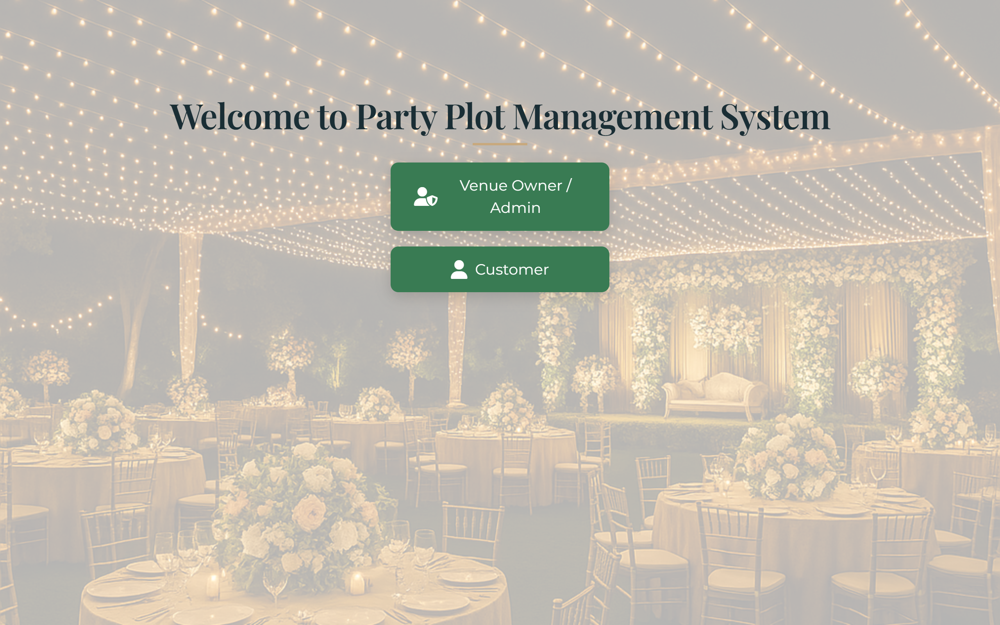

## 🌟 Features

- **User Authentication System** - Register, login, and manage user profiles
- **Venue Management** - Browse, search, and book party venues
- **Admin Dashboard** - Comprehensive venue and booking management
- **Review System** - Users can leave and view reviews for venues
- **Responsive Design** - Works seamlessly across devices

## 📱 Application Screenshots

### User Experience

<table>
  <tr>
    <td>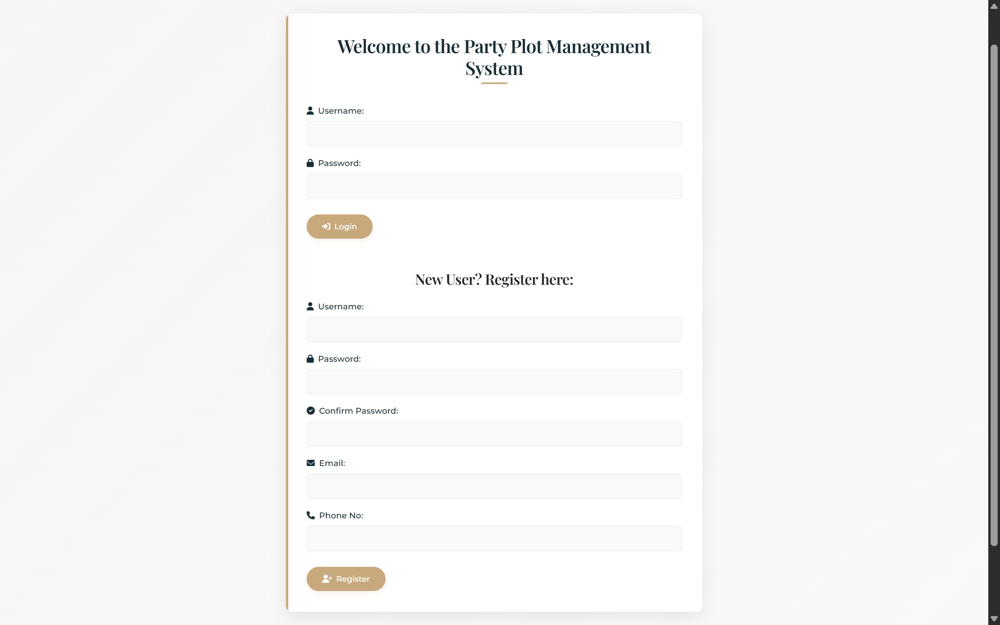</td>
    <td>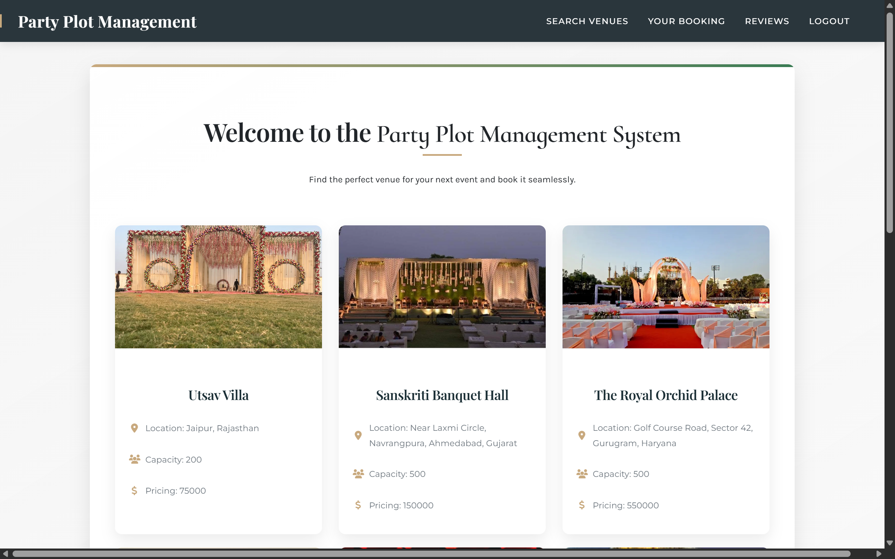</td>
  </tr>
  <tr>
    <td>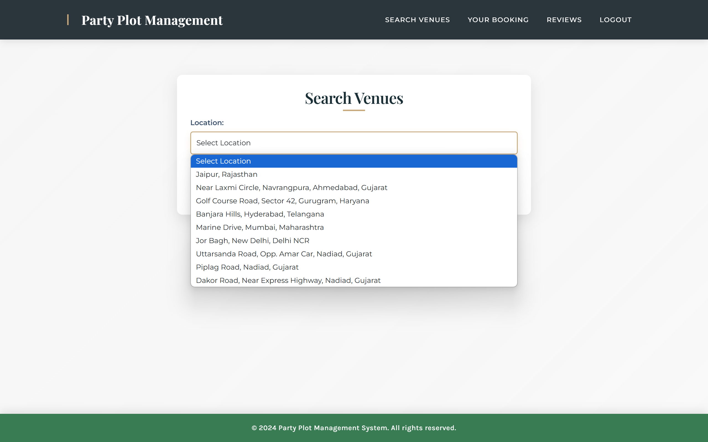</td>
    <td>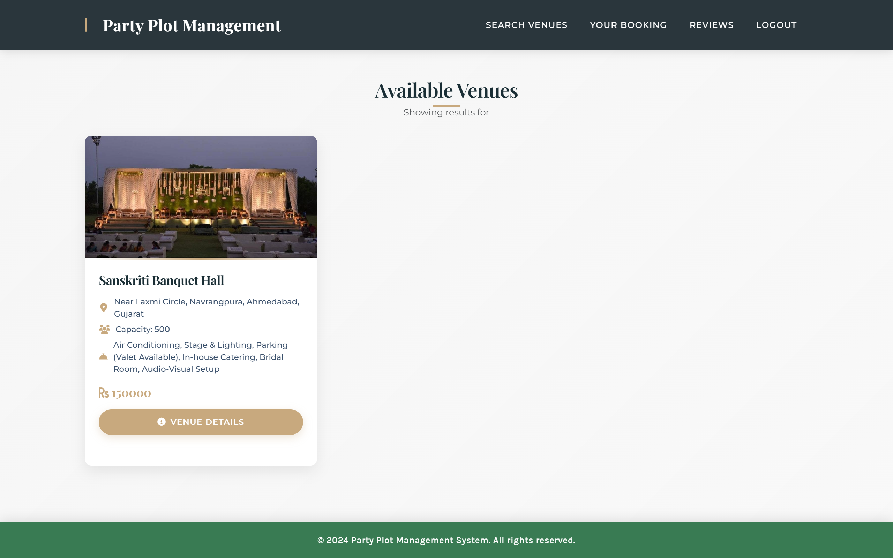</td>
  </tr>
  <tr>
    <td>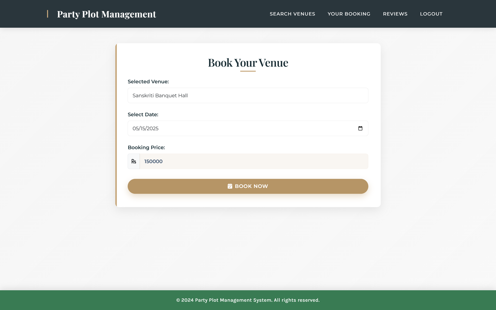</td>
    <td>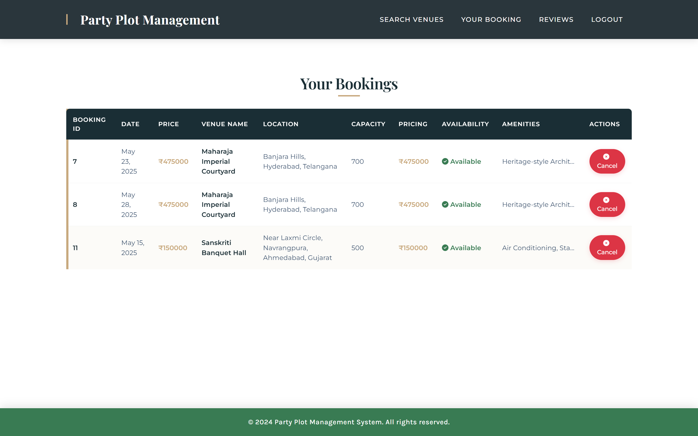</td>
  </tr>
  <tr>
    <td>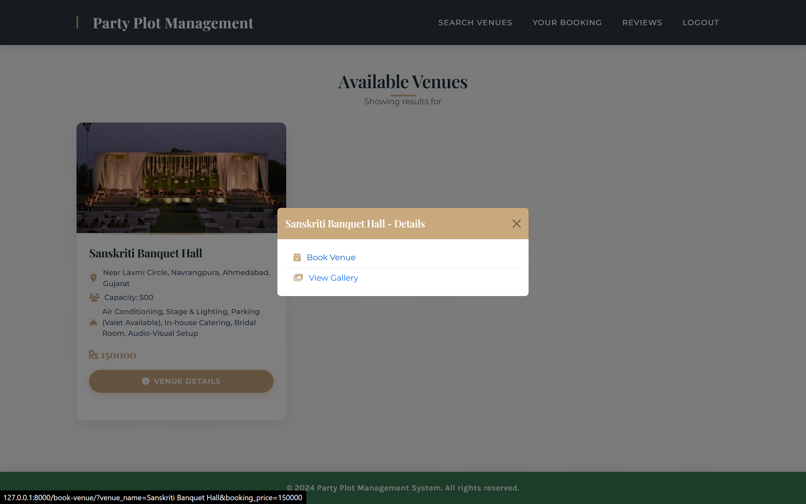</td>
    <td>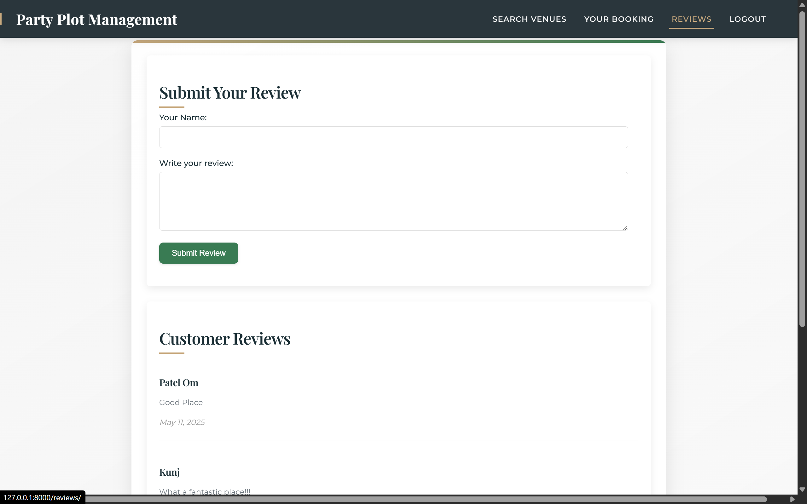</td>
  </tr>
</table>

### Admin Experience

<table>
  <tr>
    <td>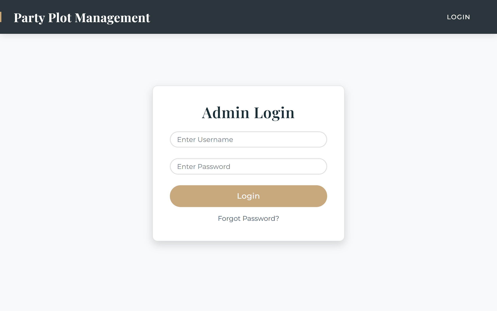</td>
    <td>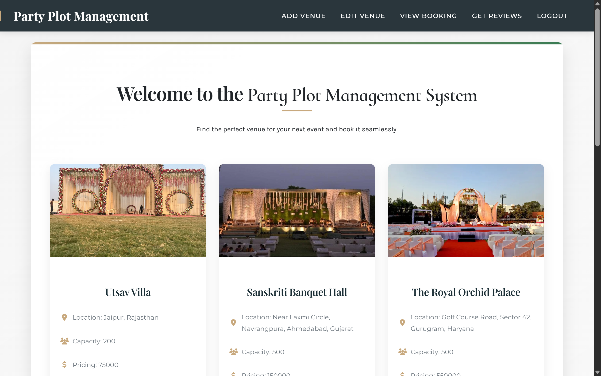</td>
  </tr>
  <tr>
    <td>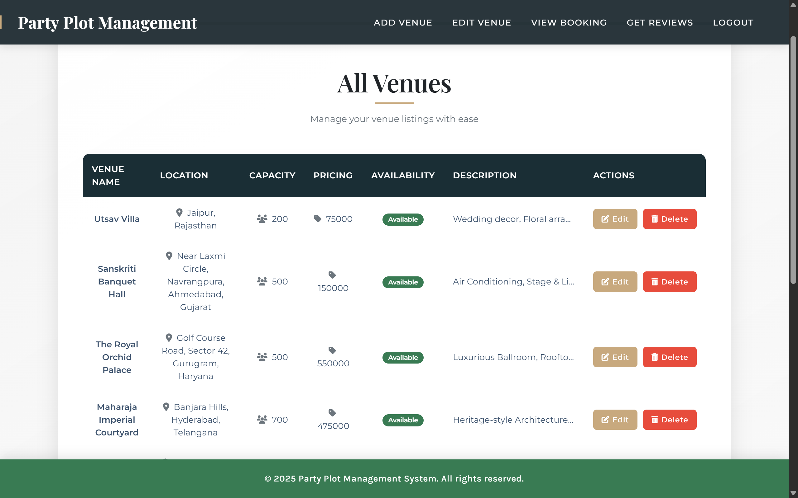</td>
    <td>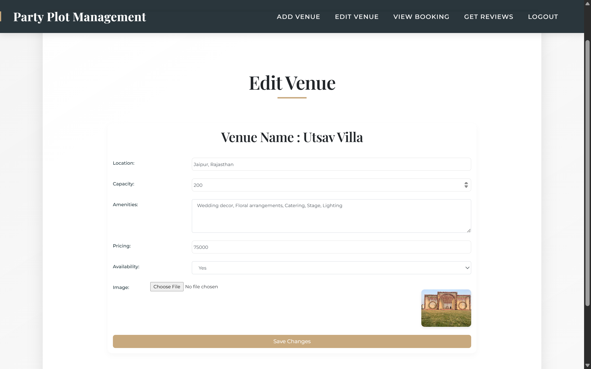</td>
  </tr>
  <tr>
    <td>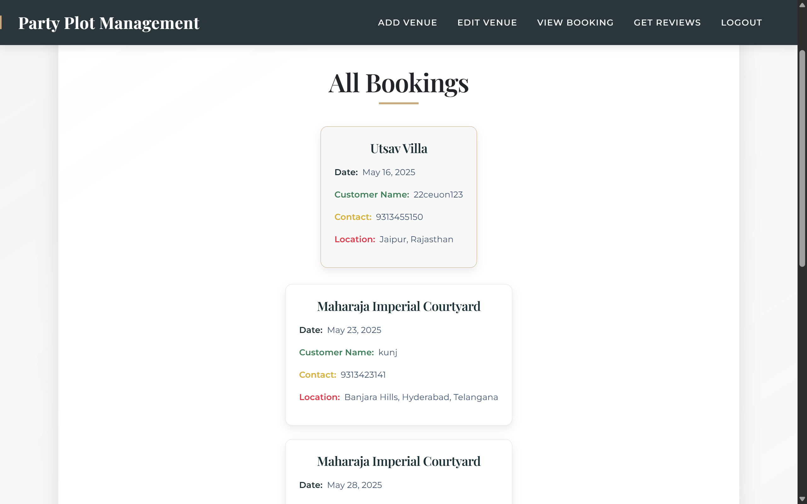</td>
    <td>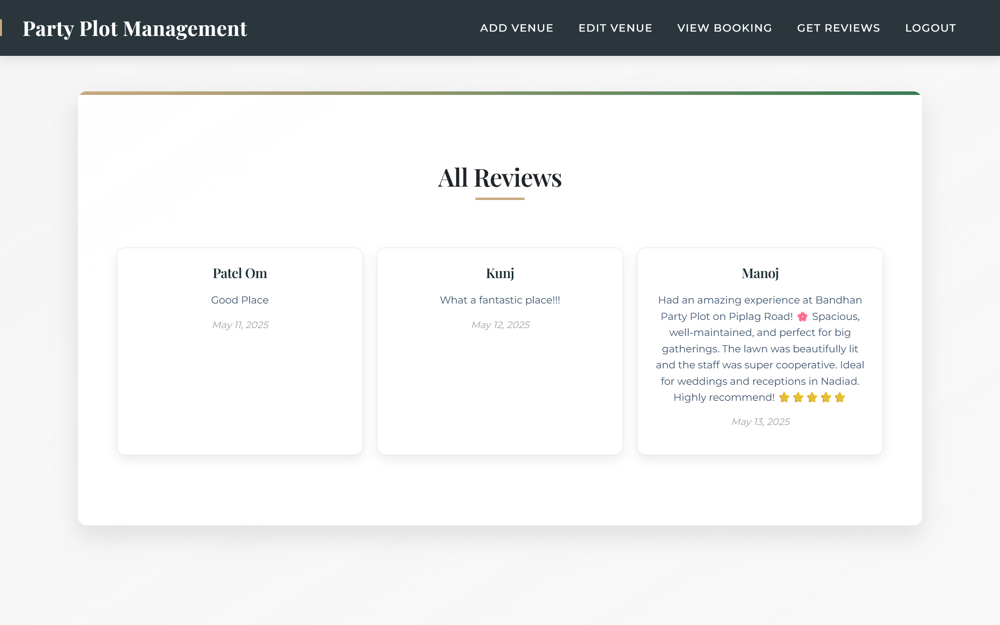</td>
  </tr>
</table>

## 🛠️ Technology Stack

- **Backend**: Django (Python)
- **Database**: SQLite
- **Frontend**: HTML, CSS, JavaScript
- **Version Control**: Git

## 📂 Project Structure

```
PPMS/
├── db.sqlite3                # SQLite database file
├── manage.py                 # Django's command-line utility
├── templates/                # HTML templates
├── static/                   # Static files (CSS, JS)
├── ppms_app/                 # Main application
│   ├── models.py             # Database models
│   ├── views.py              # View functions
│   ├── urls.py               # URL configurations
│   ├── forms.py              # Form definitions
│   └── admin.py              # Admin configurations
└── ppms/                     # Project settings
    ├── settings.py           # Main settings file
    ├── urls.py               # Main URL configurations
    └── wsgi.py               # WSGI configurations
```

## 🚀 Installation and Setup

1. Clone the repository
   ```bash
   git clone https://github.com/yourusername/PPMS.git
   cd PPMS
   ```

2. Install dependencies
   ```bash
   pip install -r requirements.txt
   ```

3. Apply migrations
   ```bash
   python manage.py migrate
   ```

4. Create a superuser
   ```bash
   python manage.py createsuperuser
   ```

5. Run the development server
   ```bash
   python manage.py runserver
   ```

## 👥 User Roles

### Regular Users
- Browse available venues
- Search venues by criteria
- Book venues for events
- View and manage their bookings
- Submit reviews for venues

### Administrators
- Manage all venues (add, edit, delete)
- Review and manage bookings
- Moderate user reviews
- View system analytics

## 🔄 Workflow

1. Users register and log in to the system
2. They can search for venues based on location, capacity, or date
3. Users can view detailed information about each venue
4. They can book a venue for their event
5. After the event, users can submit reviews
6. Admins manage venues, bookings, and reviews through the admin dashboard

## 🔮 Future Enhancements

- Payment gateway integration
- Event planning tools
- Mobile application
- Advanced analytics for venue owners
- Multi-language support

## 📞 Contact

For any inquiries, please reach out at [patel.om.manubhai@gmail.com](mailto:patel.om.manubhai@gmail.com)

---

Made with ❤️ by Patel Om
